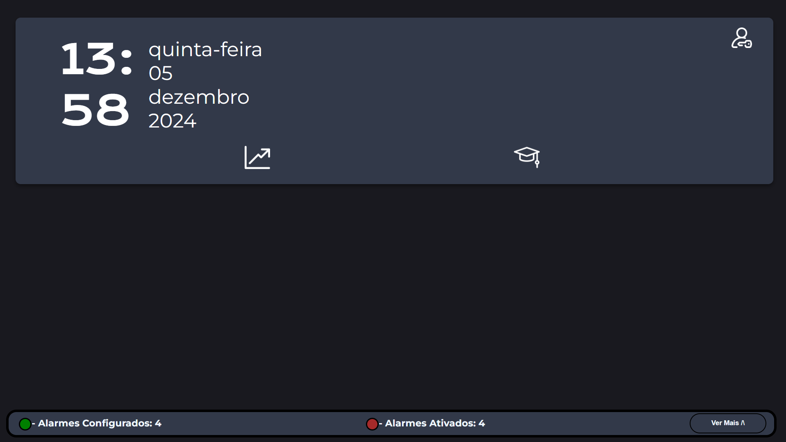

<h1>Portfólio do Aluno - Bruno Fernandes Campos</h1>
<h3>Curso: Desenvolvimento de software multiplataforma</h3>
<h3>Fatec São José dos Campos - Jessen Vidal</h3>

<h3>Sumário:</h3>
Esse repositório foi criado com o propósito de armazenar e documentar o progresso e os projetos produzidos por mim até o presente momento na faculdade Fatec SJC - Jessen Vidal.
  
Atualmente no terceiro semestre do curso, semestralmente fazemos projetos integrados chamados de A.P.I (Aprendizado por Projeto Integrado), projetos em grupo que buscam desenvolver ambas soft e hard skills, e que envolvem múltiplas matérias do curso.
  
Os projetos listados a seguir serão estes que desenvolvi em grupo com colegas, ao longo de cada semestre.

<h3>Índice: </h3>
* <a href="#sobre-mim" style="color: white;">Sobre mim</a> 
* <a href="#habilidades" style="color: white;">Principais Habilidades</a> 
* <a href="#projetos" style="color: white;">Meus projetos</a> 
* <a href="#1-semestre">1º Semestre:</a> (<a href="https://github.com/api-fatec-primeiro-semestre/api-primeiro-semestre" target="_blank">Sistema de análise de dados relacionados à Covid Longa</a>) 
* <a href="#2-semestre">2º Semestre:</a> (<a href="https://github.com/BananaaScript/BetterCallUs" target="_blank">Better Call Us - Sistema de chamadas de serviço</a>) 
* <a href="#3-semestre">3º Semestre:</a> (<a href="https://github.com/BananaaScript/SGA" target="_blank">SGA - Sistema gerenciador de ativos</a>) 
* <a href="#4-semestre">4º Semestre:</a> (<a href="https://github.com/BananaScripts/Meteorological-Data-Collector" target="_blank">Seth - Meteorological Data Collector</a>) 

<h3 id="sobre-mim">Sobre mim</h3>
 

Meu nome é Bruno Fernandes Campos. Sou natural de São José dos Campos, e desde criança, sempre fui muito ligado á tecnologia, sempre me envolvendo e tentando conhecer mais, principalmente por meio de jogos eletrônicos.
  
No meu primeiro ano do ensino médio, em uma época onde morava em Minas Gerais, passei no concurso para o curso técnico do Instituto Federal (IFMG). Lá, cursei o primeiro ano em informática, tendo assim meu primeiro contato com programação, diferentes linguagens, lógica, e manutenção de computadores.
Contudo, devido á motivos familiares, fui obrigado a abandonar o curso depois do primeiro ano, retornando a um ensino convencional para o restante do ensino médio.
  
Em 2023, após terminar o ensino médio, fiz o vestibular para o curso de desenvolvimento de software multiplataforma da Fatec São José dos Campos, e consegui passar depois de um bom tempo de estudo aplicado. O curso me chamou bastante a atenção, já que tinha um foco muito parecido com o motivo que decidi seguir nessa área: O desenvolvimento de jogos. Outros cursos na área eram muito mais focados em programação de sistemas, e não me interessavam tanto.
  

<h4 align="center"><a target="_blank" href="https://www.linkedin.com/in/bruno-campos-97560b231/">Linkedin</a> | <a target="_blank" href="https://github.com/BrunoFerCam">Github</a></h4>

<h3 id="habilidades">Principais habilidades:</h3>

* Typescript - Experiência em diversos projetos.
* Html e Css - Uso para a liderança na criação de diversos frontends.
* Python - Experiência contínua com a integração de várias funções.
* Docker - Maestria em criar e manter imagens e contêineres.
* Google Cloud - Capacidade de criar, subir e fazer deploys na nuvem.
* SQL - Experiência com a criação e integração de bancos de dados.

<h3 id="projetos">Projetos:</h3>

<h4 id="1-semestre">Sistema de análise de dados relacionados à Covid Longa</h4>

O primeiro projeto criado por nós tinha um foco na coleta e processamento de dados do Covid-19 e como ele impactava vítimas á longo prazo. Fizemos isso criando um site que permitisse que o usuário visualizasse os dados de sintomas que pudessem ou não serem relacionados á chamada de "covid longa", série de sintomas que persistem mesmo depois do fim do ciclo da doença.

  

O método usado foi o da raspagem de dados, á partir dos dados do site de saúde pública TabNet, que disponibiliza dados de saúde pública do Brasil. O alvo das análises foram cidades do vale do Paraíba, região onde a faculdade se encontra.

  

Foram utilizadas várias tecnologias nesse primeiro projeto, como HTML, CSS, e React para a construção da página, e Python para a realização da raspagem de dados. Também foi utilizado o Github para a organização do projeto, e o Figma para a geração do wireframe.

 
 
 
 
 
 

<h3> Projeto final: </h3>

<h4> Minhas contribuições ao projeto: </h4>

Como meu primeiro projeto na fatec, foi um processo um pouco confuso na hora da distribuição e organização dos membros. Contudo, terminei ficando com a principal tarefa de desenvolvimento do wireframe da interface do site, e depois implementação desse wireframe no site em si. 

  

Foi um processo muito recompensador, já que para mim, a parte mais interessante de se criar um site é a estética e experiência do usuário. Então, tendo terminado no frontend do projeto, pude ampliar meus conhecimentos nessa área e colocar em prática o que aprendi. Esse projeto dependeu bem pouco do backend, então não tive muito contato com linguagens que não fossem de marcação. 

  

<h4> O que aprendi: </h4>

 - Funcionalidades básicas de ferramentas como o Figma e o Github. 
 

 - O processo de criação de páginas usando o HTML e o CSS, colocando em prática todas as heurísticas de design que eu conhecia até ali. 
 

 - Como funciona o método ágil para a elaboração de um projeto. 
 
<h4> Hard Skills: </h4>
<table align="center">
    <tr>
      <th width="300px">Tecnologia</th>
      <th width="300px">Classificação</th>
    </tr>
    <tr>
      <td>Git / Github</td>
      <td>Uso sem dificuldade superficialmente.</td>
    </tr>
    <tr>
      <td>Python</td>
      <td>Consigo criar e compreender funções simples e medianas.</td>
    </tr>
    <tr>
      <td>Flask</td>
      <td>Consigo usar para criar sites simples com o apoio dos outros membros.</td>
    </tr>
    <tr>
      <td>Html</td>
      <td>Bem versado nesta área, consigo criar páginas complexas com várias funcionalidades.</td>
    </tr>
    <tr>
      <td>Css</td>
      <td>Uso a tecnologia em conjunto com o HTML para criar páginas web agradáveis aos clientes.</td>
    </tr>
    <tr>
      <td>Figma</td>
      <td>Bem versado em criar os wireframes que servem como planta do site.</td>
    </tr>
  </table>
 
<h4> Soft Skills: </h4>

 Durante minha jornada acadêmica e projetos realizados, desenvolvi diversas soft skills que foram fundamentais para meu aprendizado e evolução. Aprendi a importância de trabalhar com metodologias ágeis, compreendendo o funcionamento do sistema de desenvolvimento ágil e a necessidade de uma comunicação clara e eficiente entre os membros da equipe. Além disso, aperfeiçoei minha organização e planejamento, aplicando ferramentas como tasks da sprint e técnicas como o planning poker, que ajudaram a estruturar melhor as etapas de desenvolvimento.

Outro aspecto marcante foi a adaptação ao estilo de ensino da Fatec, um método mais inovador e não ortodoxo em comparação com minhas experiências anteriores. Essa adaptação exigiu resiliência e flexibilidade, contribuindo para minha capacidade de enfrentar novos desafios e me ajustar a diferentes contextos acadêmicos e profissionais. 
 

________________________________________________________________________________________________________________________________________________________________________

<h4 id="2-semestre">Better Call Us - Sistema de chamadas de serviço</h4>

 O segundo projeto desenvolvido, depois de uma necessária troca de equipe, foi o Better Call Us, um sistema de chamadas de serviço. O projeto tinha três frentes diferentes:

O usuário, que tinha o poder de solicitar uma chamada para um suporte, fosse ela para fazer uma pergunta, requisitar uma manutenção, ou fazer uma reclamação.

O suporte, que tinha o poder de aceitar ou recusar a chamada, e, caso aceitasse, poderia conversar com o usuário através de mensagens que funcionavam como emails. Ele poderia visualizar todas as chamadas em aberto ou em pendência e associar uma delas á si mesmo.

E o administrador, que tinha o poder de criar, editar e deletar usuários e suportes, além de poder visualizar todas as chamadas em aberto, pendentes e fechadas, podendo assim fazer a manutenção dos status, suportes e mensagens.

  

O projeto também contava com uma página de perguntas frequentes, onde, como uma página de ajuda, o usuário poderia encontrar respostas para perguntas comuns. Essa página continha várias sessões diferentes com perguntas abrangentes, e o usuário poderia clicar em uma pergunta para ver a resposta ou instruções se necessário.

Foram utilizadas várias tecnologias novas e recorrentes, como o CSS e HTML para a criação da estrutura web do site, o mySql para a criação do banco de dados que contém as perguntas, mensagens, clientes, suportes e etc., o Node.js e o Spring para a criação da aplicação, O react para a implementação online do Typescript, o Figma para a criação do wireframe e o Github para a organização.

 
 
 
 
 
 
 
 
 

<h3> Projeto final: </h3>

<h4> Minhas contribuições ao projeto: </h4>

 Minha principal contribuição ao projeto foi a criação do front-end, que foi feito em HTML e CSS, e a criação do design do site, que foi feito no Figma. Esse projeto envolvia bem mais telas distintas que o projeto anterior, então gerir o front-end dele foi bem mais trabalhoso.

  

Também comecei a me familizarizar com o Typescript, utilizado como base principal do projeto. Eu não tive muito envolvimento com o backend, mas para a implementação do front-end, tivemos que migrar a produção do site do HTML para o Typescript. Mesmo que não tenha me envolvido com o sistema do banco de dados, mas pude ver como ele foi feito e como ele se comunicava com o front-end, o que foi uma experiência muito valiosa.

<h4> O que aprendi: </h4>

 - Como implementar novas tecnologias, como o Typescript e o mySql. 
 

 - Como "traduzir" os designs de páginas do HTML para o Typescript. 
 

 - Como aplicar o método ágil para a organização de tarefas do grupo. 
 
<h4> Hard Skills: </h4>
<table align="center">
    <tr>
      <th width="300px">Tecnologia</th>
      <th width="300px">Classificação</th>
    </tr>
    <tr>
      <td>Git / Github</td>
      <td>Consigo manusear e gerenciar repositórios sem dificuldades.</td>
    </tr>
    <tr>
      <td>Html</td>
      <td>Consigo criar páginas com facilidade.</td>
    </tr>
    <tr>
      <td>Css</td>
      <td>Total controle e liberdade sobre a estilização.</td>
    </tr>
    <tr>
      <td>Figma</td>
      <td>Dominei completamente o uso da plataforma para criar wireframes.</td>
    </tr>
    <tr>
      <td>Typescript</td>
      <td>Consigo realizar tarefas mais simples relacionadas ao frontend, como a integração.</td>
    </tr>
    <tr>
      <td>mySql</td>
      <td>Compreendo as lógicas de bancos de dados existentes mas tenho dificuldades em criá-los.</td>
    </tr>
  </table>
 
<h4> Soft Skills: </h4>

 Durante o desenvolvimento deste projeto, aprimorei minhas habilidades em metodologias ágeis, consolidando a aplicação do sistema ágil para distribuir tarefas. Essa abordagem foi crucial devido ao aumento no volume e na complexidade das tasks em comparação ao projeto anterior.

Também desenvolvi resolução de problemas técnicos, especialmente ao lidar com dificuldades na integração entre front-end e back-end, adquirindo mais experiência em comunicação entre sistemas.

Por fim, trabalhar com uma equipe mais integrada e sincronizada proporcionou uma colaboração mais fluida, reforçando a importância do trabalho em equipe para o sucesso do projeto. 
 

________________________________________________________________________________________________________________________________________________________________________

<h4 id="3-semestre">SGA - Sistema de Gerenciamento de Ativos</h4>

 O terceiro e mais recente projeto desenvolvido, o SGA se trata de um projeto muito útil e expansivo: Manter o controle de todo um sistema que permita que o administrador manipule e tenha informação completa sobre todos os ativos de sua empresa de forma organizada e ágil.

 O projeto foi dividido em duas frentes diferentes:

 O administrador, que tinha o poder de criar, editar e deletar ativos e membros do time, além de poder visualizar todos os ativos em uso ou estado de manutenção. Além disso, ele poderia marcar quais ativos estão sendo utilizados por qual usuário.

 E o usuário, que tinha o poder de alterar o estado de ativos que tivessem sido designados a ele.

  

O projeto também continha um sistema de gráficos com uma relação de custo e uso de cada ativo, reçacionando custos de uso e manutenção.

Além disso, o projeto também continha um sistema de notificações, que notificava o usuário quando um ativo estava prestes a sair do estado de manutenção, ou quando um ativo estava sendo utilizado por outro usuário.

  

 Nesse projeto, houve uma estipulação extra: Ele deveria ser feito no estilo single-page application, ou seja, uma página que funciona completamente na mesma rota.

Foram utilizadas várias tecnologias novas e tecnologias antes exploradas só que com mais aprofundamento, como o Typescript e o CSS para a criação do frontend da página, o mySql para a criação do banco de dados que contém os ativos e usuários, além dos preços para os gráficos, o Node.js e o Spring para a criação da aplicação, O react para a implementação online do Typescript, o Java para a criação da lógica do backend, o Figma para a criação do wireframe e o Github para a organização.

 
 
 
 
 
 
 
 
 

<h4> Minhas contribuições ao projeto: </h4>

 Minha principal contribuição ao projeto foram contribuições do front-end do projeto, que dessa vez eram bem mais complexas em relação ao anterior. Também fui o responsável pela criação do wireframe do site, que foi feito no Figma. Nesse ponto, usei meu conhecimento até agora para criar um site com um design profissional e agradável seguindo os padrões de single-page application requeridos.

  

Também tive que dessa vez fazer contribuições ao backend para finalizar minhas tarefas, mesmo que não tenha tido que entrar em tanto contato com a lógica do backend, tive que entender como ele funcionava para poder implementar o front-end de forma correta.

<h4> O que aprendi: </h4>

 - A importância de tecnologias como o Node.js e Spring, que facilitam o desenvolvimento de aplicações web e fornecem recursos poderosos para a criação de sistemas ágeis e eficientes. 
 

 - Como o Typescript, mesmo que mais complicado, permite a criação de páginas web muito mais complexas e avançadas que o HTML. 
 

 - A multitude de usos do Java, que permite conexões muito dinâmicas com o banco de dados. 
 
<h4> Hard Skills: </h4>
<table align="center">
    <tr>
      <th width="300px">Tecnologia</th>
      <th width="300px">Classificação</th>
    </tr>
    <tr>
      <td>Git / Github</td>
      <td>Tenho total controle e domínio em relação a coisas como branches e submódulos.</td>
    </tr>
    <tr>
      <td>React</td>
      <td>Me familiarizei com a tecnologia e consigo usá-la para criar páginas.</td>
    </tr>
    <tr>
      <td>Css</td>
      <td>Domino o uso da tecnologia, e a uso para treinar minhas habilidades de design web.</td>
    </tr>
    <tr>
      <td>Figma</td>
      <td>Dominei completamente o uso da plataforma para criar wireframes.</td>
    </tr>
    <tr>
      <td>Typescript</td>
      <td>Consigo usar a ferramenta para a criação e controle de ambos frontend e backend.</td>
    </tr>
    <tr>
      <td>mySql</td>
      <td>Consigo criar bancos de dados simples.</td>
    </tr>
  </table>
 
<h4> Soft Skills: </h4>

 Durante este projeto, aprimorei minhas habilidades em comunicação com o cliente, aprendendo a importância de estabelecer metas plausíveis e definir entregas claras e objetivas. Essa prática foi essencial para alinhar expectativas e garantir a satisfação do cliente ao longo do processo.

Também desenvolvi um entendimento mais aprofundado sobre a importância da documentação e organização de tasks. Percebi como essas ferramentas podem ser vitais para o equilíbrio das atividades entre os membros da equipe, permitindo uma distribuição mais eficiente das tarefas e promovendo um fluxo de trabalho mais colaborativo.

Além disso, tive a oportunidade de melhorar minha comunicação com a equipe, o que contribuiu para fortalecer o alinhamento entre os membros e aumentar a fluidez no desenvolvimento do projeto. Essa experiência reforçou como uma comunicação aberta e eficiente é essencial para o sucesso de qualquer iniciativa em grupo.

 

<h4 id="4-semestre">Meteorological Data Collector</h4> 

O **Meteorological Data Collector** foi desenvolvido para coletar, exibir e gerenciar dados meteorológicos em uma interface simples e intuitiva. Além disso, o projeto inclui um sistema de ensino básico, focado em introduzir conceitos matemáticos relacionados à meteorologia, como média aritmética, regra de três e gráficos.
    
O sistema exibe informações meteorológicas em tempo real, como temperatura, umidade e velocidade do vento, extraídas de uma API externa. Esses dados são organizados em gráficos e tabelas para fácil análise. Já a parte educacional conta com módulos interativos para aprendizado, com exercícios práticos e material didático diretamente relacionados aos dados meteorológicos apresentados.
    
Para a implementação do projeto, utilizamos tecnologias como React e TypeScript no front-end, Node.js para a criação da API do sistema, e Docker para containerização e deploy. O Google Cloud foi usado como infraestrutura para hospedar e escalar a aplicação. Também fiquei reponsável pelo sistema de educação necessário para a página

  
 
 
 
 
 
 
 
 
 

 

<h3> Projeto final: </h3>

<h4> Minhas contribuições ao projeto: </h4> 

Minha principal responsabilidade foi o desenvolvimento completo do front-end, garantindo que todas as funcionalidades fossem exibidas de forma clara e acessível para os usuários. Além disso, fui responsável pelo deploy do projeto utilizando Docker para criar os containers e o Google Cloud para hospedar a aplicação, garantindo sua disponibilidade e escalabilidade.
    
Essas tarefas foram extremamente desafiadoras, mas também muito recompensadoras, pois me permitiram aprimorar minhas habilidades em containerização e deploy, além de consolidar meu conhecimento em desenvolvimento front-end.
    <h4> O que aprendi: </h4> 
 - Como utilizar Docker para criar e gerenciar containers de forma eficiente.
 

 - Processos de deploy em cloud utilizando o Google Cloud Platform.
  

 - Desenvolvimento de interfaces interativas e responsivas utilizando React e TypeScript.
  

 - Integração de APIs para exibir dados em tempo real.
  
<h4>Hard Skills:</h4>
<table align="center">
  <tr>
    <th width="300px">Tecnologia</th>
    <th width="300px">Classificação</th>
  </tr>
  <tr>
    <td>Docker</td>
    <td>Como responsável pelo deploy, aprendi a criar e distribuir imagens para a criação de contêineres.</td>
  </tr>
  <tr>
    <td>Google Cloud</td>
    <td>Como responsável pelo deploy, aprendi a manusear o sistema do cloud run</td>
  </tr>
  <tr>
    <td>React</td>
    <td>Consigo usar a biblioteca para criar páginas web com facilidade.</td>
  </tr>
  <tr>
    <td>TypeScript</td>
    <td>Consigo criar e compreender lógica para ambos frontend e backend sem dificuldades.</td>
  </tr>
</table>
 
<h4>Soft Skills:</h4>

- Durante este projeto, desenvolvi várias soft skills essenciais, especialmente diante de desafios significativos enfrentados pela equipe. Dois membros abandonaram o time durante a execução, o que exigiu uma reorganização das tarefas e redistribuição de responsabilidades. Isso reforçou a importância de planejamento eficiente e organização das tasks, utilizando metodologias ágeis para manter o progresso do projeto e assegurar entregas de qualidade.

Também precisei me adaptar rapidamente a novas ferramentas e tecnologias, especialmente no contexto de uma equipe reduzida, o que exigiu flexibilidade e aprendizado acelerado para cobrir áreas que antes não estavam sob minha responsabilidade direta, principalmente o docker e o google cloud.

Além disso, foi fundamental manter uma comunicação clara e eficiente com os colegas para garantir a integração de diferentes partes do sistema, especialmente com o responsável pelo deploy. A expertise dele em DevOps foi essencial para superar obstáculos técnicos e possibilitar um processo de deploy mais fluido e confiável, mesmo sob pressão.

 

